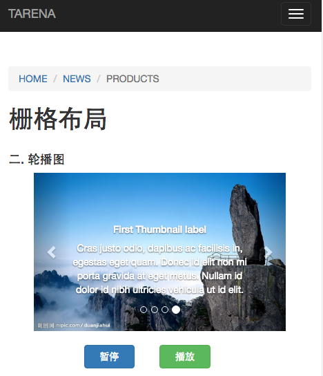

# My Progress
<abbr title="Hyper Text Markup Language">菜鸟进阶打怪中</abbr>`一起来战`

#### Bootstrap

* 运用Bootstrap的栅格系统
* 练习运用Bootstrap的大多组件
* 完美响应
* 页面简洁美观
* 缺少真正的交互

> Bootstrap效果图-局部.

#### Backbone

* MVC模型
* 适合大型项目开发的Backbone
* 解决数据自动刷新问题
* 只是一个基础项目

> Bootstrap效果图-局部.

